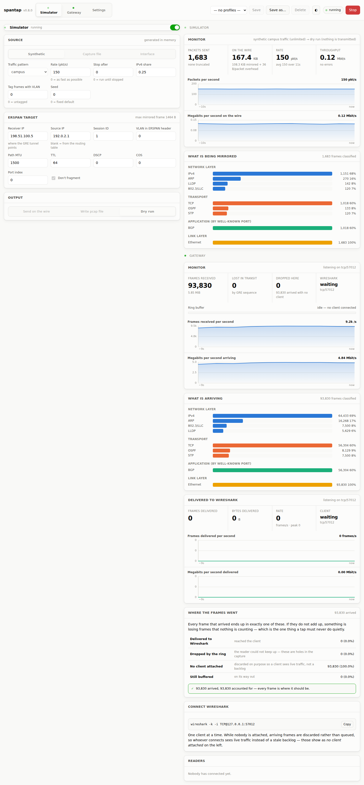
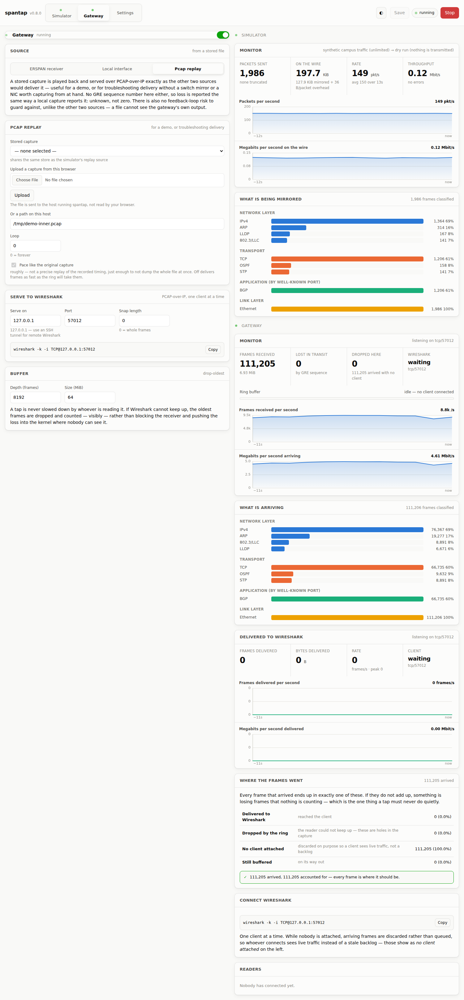

<p align="center">
  
</p>

# spantap

*(Formerly `erspan-sim` / `erspan-gw` — same code, new name, your existing
install carries over. See [Upgrading from erspan-sim](#upgrading-from-erspan-sim).)*

Three tools, one package.

**`spantap-gw`** is the gateway: it takes real traffic — either ERSPAN Type II
mirrored from a switch on a raw GRE socket, or a local interface it captures
itself — and serves it to Wireshark over PCAP-over-IP, so you can point
Wireshark at a mirror port, or at a box with no switch mirroring it, from
anywhere. It comes with a web UI for configuring and monitoring it.

**`spantap-sim`** is the simulator that lets you test the ERSPAN side — and any
other ERSPAN receiver — without a Catalyst or Nexus handy. It takes packets
from a pcap file, a live interface, or a built-in traffic generator, wraps
each one in IPv4/GRE/ERSPAN Type II and sends it.

**`spantap-lite`** is a separate, minimal install of just the capture ->
PCAP-over-IP half: no web UI, no accounts, no simulator — `configure`,
`start`, `stop`, and nothing else. See [spantap-lite](#spantap-lite) below.

Python 3.9+, standard library only, Linux first.

```
  spantap-sim                                       spantap-gw
  ┌── replay  (pcap / pcapng)  ──┐                  ┌─────────────┐
  ├── live    (dumpcap/tcpdump) ─┤→ ERSPAN II ─ ─ ─→│ raw GRE rx  │
  └── synth   (generated)      ──┘   GRE/IPv4       │      or     │
                                                    │ live capture│
        or → a pcap file, no privileges needed      │     ↓       │
                                                    │ ring buffer │
                                                    │     ↓       │
                                                    │ pcap-over-ip│→ wireshark
                                                    └─────────────┘   TCP@:57012
```

Both are driven from the same web UI (`spantap-sim gui`), or from the command
line.

## Install

Container-only, on purpose: every prerequisite a native install had to check
for — a `python3-venv` package, `setcap` living somewhere a non-root user's
`$PATH` doesn't include, distro-specific tool package names — is exactly the
kind of friction Docker removes outright. (If you're carrying over a native
install from an older release, see
[Upgrading from erspan-sim](#upgrading-from-erspan-sim).)

### Docker

```sh
git clone https://github.com/netwho/spantap && cd spantap
./install.sh --check-only --dst 10.0.0.5   # look before you leap
./install.sh --dst 10.0.0.5
```

The installer checks first and installs second. Preflight covers: the docker
engine and compose plugin, the route and **path MTU** to the receiver (it
tells you how much of each frame will survive), whether a firewall might eat
IP protocol 47, whether tcp/57012 is free for the gateway's PCAP-over-IP side
later, and any existing containers.

It then sets up `./captures` and `./tls` with the permissions the container's
uid needs, builds the image, and finishes by generating, encapsulating and
decoding 25 packets inside the built container to prove the installation
works. It does not need root — being in the `docker` group is enough.

Last, it offers to give the web UI a TLS certificate. Paste the certificate
(PEM, a full chain is fine) and press Enter on an empty line, then paste the
private key the same way — it is not echoed, and a paste that already holds
both skips the second prompt. **Press Enter at the first prompt to skip** and
stay on plain HTTP; you can set one later on the Settings tab. The pair is
checked exactly like the Settings tab's upload: a key that does not match
the certificate, or one still protected by a passphrase, is refused with
nothing stored. It lands in the config volume, so a running UI picks it up
on `docker compose --profile gui restart gui` (or `gui-lan`).

It ends with a summary: the commands to start each service, and for the web
UI every URL it will answer on **with the token already in it** — the
installer creates the token and saves it in the config volume, so the UI uses
that same one when it starts — how to add an account, and links to the web UI
sections of this README.

Without a terminal, or with `--yes`, there is no prompt; pass files instead:

```sh
./install.sh --yes --tls-cert tls/cert.pem --tls-key tls/key.pem
```

The same import is available on its own at any time:

```sh
cat cert.pem key.pem | docker compose --profile gui run --rm -T \
    --entrypoint spantap-sim gui tls import
```

```sh
./install.sh --uninstall      # docker compose down (config volume kept)
```

Useful flags: `--yes`, `--check-only`, `--dst IP`, `--tls-cert FILE`, `--tls-key FILE`.

You can also skip the installer and drive the image directly:

```sh
docker build -t spantap:0.9.3 .
docker run --rm --network host --cap-add NET_RAW \
    spantap:0.9.3 synth --dst 10.0.0.5 --pps 100
```

The image carries `tshark`/`dumpcap`, so all three simulator sources — and the
gateway's local-interface capture — work inside it, and runs as a non-root
user with file capabilities rather than as root. `--network host` is needed
for anything touching a real interface, and `--cap-add NET_ADMIN` as well for
`live` capture or promiscuous mode.

`docker-compose.yml` has: `sim` (synthetic feed, the default), `gateway`
(ERSPAN in, PCAP-over-IP out, `--profile gateway`), `gateway-live` (same, fed
by a local interface instead, `--profile gateway-live` — `eth0` unless you set
`SPANTAP_IFACE=ens18`, or whatever `ip -br link` shows, in `.env`), `gui` /`gui-lan`
(the web UI on every address with a token — generated and saved by `gui`,
taken from `SPANTAP_TOKEN` in `.env` by `gui-lan`), `capture` (mirror a host
interface as ERSPAN, `--profile capture`), `replay` (loop a file from
`./captures`, `--profile replay`) and `lite` (spantap-lite, `--profile lite`
— see [spantap-lite](#spantap-lite)). Any of them can be left running with
`restart: unless-stopped` (already set) so it comes back after a reboot or a
crash — there is no separate systemd unit to install.

```sh
docker compose run --rm sim doctor
docker compose up -d sim
```

### From the source tree

No install at all: `python3 -m spantap ...` works straight out of the
checkout. `make help` lists the shortcuts.

## spantap-lite

A bare capture -> PCAP-over-IP tap, with none of the rest of this package: no
web UI, no accounts, no simulator, no ERSPAN. Point it at a network card, or
at a capture file to play back on a loop, and Wireshark connects to it on
tcp/57012. It reuses the gateway's own capture pipeline (the same
live-interface capture, exclusion filter and PCAP-over-IP server as
`spantap-gw`), but the whole surface is three commands: `configure`, `start`
and `stop`.

### Install

```sh
./install.sh --lite             # builds the image, then runs 'configure'
./install.sh --lite --uninstall
```

It is a **separate install**, on purpose — it does not touch (and does not
require) the simulator, the gateway or the web UI. If you already ran
`./install.sh`, the image is built and you can go straight to the next step.

### Capture a network card

```sh
ip -br link                                      # find the interface name
docker compose run --rm lite configure --non-interactive --iface ens18 --no-save
docker compose --profile lite up -d lite
```

Then, from any host that can reach this one:

```sh
wireshark -k -i TCP@<this host>:57012
```

### Play back a capture file

Put the file in `./captures` (next to `docker-compose.yml`) — that directory
is mounted into the container — and name it by its file name:

```sh
cp ~/demo.pcapng captures/
docker compose run --rm lite configure --non-interactive --replay-file demo.pcapng --no-save
docker compose --profile lite up -d lite
```

The file plays on an endless loop, at roughly its own recorded pace (one long
idle gap in the file is capped so a demo never stalls). Classic pcap and
pcapng both work. No interface and no capture privileges are involved.

### Day to day

```sh
docker compose --profile lite logs -f lite      # packets, rate, drops, client
docker compose --profile lite stop lite
docker compose --profile lite start lite
docker compose run --rm lite configure          # change settings (asks), then:
docker compose --profile lite restart lite
```

Without `--non-interactive`, `configure` asks — and lists the files already in
`./captures`, so you can pick one by name. It keeps running across reboots
(`restart: unless-stopped`) until you `stop` it.

**One PCAP-over-IP service at a time.** `lite`, `gateway` and `gateway-live`
all serve tcp/57012 by default, so a second one fails to start with the port
in use. Stop the other (`docker compose --profile gateway stop gateway`), or
give lite another port with `configure --listen 57013`.

### What `configure` asks

`configure` asks for a source (a live interface, or an existing pcap file to
replay instead — no interface needed either way if you are just trying it
out), the PCAP-over-IP bind address and port (default `0.0.0.0:57012` —
unlike `spantap-gw`, which defaults to loopback because it is normally driven
from the web UI, spantap-lite has no UI to tunnel through), an optional local
save-to-file capped at a size you choose (500 MiB by default — once reached,
it simply stops growing; the PCAP-over-IP side is unaffected), whether to
also exclude your own SSH session from the capture (default yes — its own
PCAP-over-IP traffic is *always* excluded, the same mandatory clause
`spantap-gw` uses, so this loop-prevention filter is never something you can
turn off by mistake), and an optional custom BPF filter on top (default
none). Every flag `configure` asks about interactively also has a CLI flag,
for scripted installs — here also keeping a copy, capped at 500 MiB, in
`./captures` on the host:

```sh
docker compose run --rm lite configure --non-interactive --iface ens18 --listen 57012 \
    --save-file /var/lib/spantap/captures/lite.pcap --save-max-mib 500
```

`--replay-file`, `--bind`, `--no-save`, `--exclude-ssh`/`--no-exclude-ssh`,
`--filter BPF` and `--reset` (start over from the defaults) complete the set;
`docker compose run --rm lite configure --help` lists them.

### Without Docker

From a source checkout the same three commands run directly
(`python3 -m spantap.lite.cli`, or `spantap-lite` once the package is installed);
capturing a card then needs `dumpcap` with its capabilities, as described
under [Privileges](#privileges). Here `start` runs in the foreground and
writes its own PID file, which is what lets `stop` work the same way whether
it was started under systemd (`Type=simple`), by hand, or backgrounded with
`&` — in Docker, `docker compose … logs -f lite` shows this same output:

```
$ spantap-lite start
spantap-lite 0.9.3 (pid 4213)

  source  : live capture on eth0 via dumpcap
  filter  : not (tcp port 57012) and not (tcp port 22)
  serve   : tcp/57012 on 0.0.0.0, one client at a time

  connect Wireshark with:
    wireshark -k -i TCP@127.0.0.1:57012

  Ctrl-C, or 'spantap-lite stop' from elsewhere, to stop.

    142857 packets    712/s  dropped 0  ring   0%  -> 10.0.0.9:51322 connected
```

## The gateway

```sh
spantap-gw doctor          # CAP_NET_RAW, is tcp/57012 free, where the config lives
spantap-gw run
wireshark -k -i TCP@127.0.0.1:57012
```

It has three sources, one at a time:

**ERSPAN** (the default) binds a raw socket on IP protocol 47, so it sees
ERSPAN arriving anywhere on the host — including loopback, which is what makes
a same-host bench setup work with no tunnel interface to configure. Anything
that is not well-formed ERSPAN Type II is counted and ignored rather than
guessed at.

```sh
spantap-gw run --iface eth0            # local interface instead of ERSPAN
```

**A local interface**, for a host worth watching that no switch is mirroring:
the gateway captures it directly with `dumpcap`/`tcpdump`, the same way the
simulator's `live` source does. `--capture-filter` adds your own BPF,
`--exclude-gre` also keeps out any *other* ERSPAN passing through (on by
default it would double-deliver on a box that is also an ERSPAN destination),
`--exclude-ssh` keeps your own session out. A local capture has no GRE
sequence number, so loss is reported as unknown rather than claimed as zero —
ERSPAN's is the only source that can actually count it.

**Wireshark may flag some of these frames as "Giant/jumbo"** — on-wire length
well past 1518 bytes, sometimes 2000–9000+, with no matching increase in the
interface's actual MTU. This is not spantap truncating, padding, or otherwise
mangling anything, and it is not the frame that was actually on the wire: it
is GRO/LRO (and, on the transmit side, TSO/GSO) — the kernel and/or NIC
coalescing several real segments into one larger buffer *before* the AF_PACKET
tap `dumpcap`/`tcpdump` reads from ever sees them, on the interface being
captured. `spantap-gw` forwards whatever the capture tool handed it — a real
switch mirror or an ERSPAN feed doesn't have this problem, because the
frames that leave the switch already crossed the wire before any host-side
offload gets a chance to touch them; only a local-interface capture sees the
host's own receive-side reassembly. To see genuine on-wire framing instead,
turn the relevant offloads off on the interface being captured (not the one
receiving PCAP-over-IP):

```sh
sudo ethtool -K eth0 gro off lro off tso off gso off
```

That's per-boot, not persistent, and it costs a little CPU efficiency on that
interface for as long as it's off — worth it for a troubleshooting session,
not something to leave off permanently on a box doing real traffic. Check
current state first with `ethtool -k eth0 | grep -E 'generic-receive|large-receive|tcp-segmentation|generic-segmentation'`.

```sh
spantap-gw run --replay-file demo.pcapng --loop 0
```

**A stored capture, replayed**, for a demo or for troubleshooting the
delivery side without a switch mirror or a NIC at hand — no ERSPAN feed
required. `--loop N` sets how many passes (`0`, the default, forever); by
default it paces frames at roughly the file's own recorded gaps rather than
dumping the whole thing at once — approximately, not precisely, capped so one
long idle period in the file cannot stall a demo for real time — `--no-pace`
skips that and delivers as fast as the ring will take them. Same reasoning as
the local-interface source: no GRE sequence number, so loss is unknown, not
zero, and — unlike the other two sources — no exclusion filter is needed at
all, since a file cannot see the gateway's own output. It shares the same
capture-file store (`SPANTAP_CAPTURE_DIR`) as the simulator's own `replay`
source — the web UI has an upload button on both the Simulator and the
Gateway tab, either one lands the file in the same place, so upload once and
pick it from whichever tab you're using.

**Loss is measured, not assumed, on the ERSPAN side.** ERSPAN Type II mandates
a GRE sequence number, so the receiver knows exactly how many frames went
missing between the switch and here, tracked per (source, session). That
number and the ring buffer's own drop count are different things, and the
monitor shows them separately — losing frames upstream and losing them because
Wireshark is slow call for different fixes.

**Nothing downstream can stall the receiver.** Frames go into a bounded ring;
if Wireshark cannot keep up, the oldest are dropped and counted. Blocking the
receiver instead would push the loss into the kernel's socket buffer, where
nobody can see or count it.

**The exclusion that keeps the gateway out of its own output is not optional,**
on either of the two sources that can actually see it. The frames it hands to
Wireshark leave over TCP, and if that session crosses the interface being
watched — the local-interface source especially — the gateway captures its
own output, sends that, captures it again, and the link saturates in seconds.
`not (tcp port 57012)` (built around whichever port it actually binds, not a
configured guess) is always compiled in; there is no flag that removes it.
Replay has no such filter at all — a stored file is not a live tap on
anything the gateway's own traffic could feed back into.

One Wireshark client at a time. A second connection is refused immediately
rather than left hanging, and a client that connects and leaves — a port scan,
a health check — releases the slot at once instead of holding the gateway
offline.

Useful flags: `--session N` (only one ERSPAN session), `--from IP` (only one
mirroring source), `--listen PORT`, `--bind ADDR`, `--ring N`, `--save`.

```sh
spantap-gw config          # what it will use
spantap-gw run --session 23 --listen 57012 --save
```

Remote Wireshark goes through a tunnel rather than a wider bind:

```sh
ssh -L 57012:127.0.0.1:57012 sensor.example
```

## The web UI

```sh
spantap-sim gui
```

Serves the UI on port 8420 on every address of the host (`0.0.0.0`) and
prints, at startup, every URL it can be opened at (token included), how to get
in, and links to these docs:

```text
  Open it at:
    http://127.0.0.1:8420/?token=…   (this host)
    http://192.168.1.50:8420/?token=…

  Access:
    token     …   generated and saved to ~/.config/spantap/webui.json —
                  it stays the same across restarts
    accounts  none yet — add one with: spantap-sim users add NAME
    tunnel    ssh -L 8420:127.0.0.1:8420 <this host>

  Docs:
    https://github.com/netwho/spantap#the-web-ui
    …
```

To see the token or the URLs again at any time — even before the UI has
first started, in which case the token is created and saved then:

```sh
spantap-sim token                                # just the token
spantap-sim token --urls                         # every URL, token included
docker compose exec gui spantap-sim token --urls # while the gui container runs
```

For a local-only UI, `spantap-sim gui --bind 127.0.0.1` (no token needed), or
set Bind to `127.0.0.1` on the Settings tab.

The page has two persistent panes. The **left**
pane switches between three tabs — **Simulator**, **Gateway** and
**Settings** — and each of the first two carries its own LED right on the
tab (green while it's running, so you can tell at a glance whether it's
running without leaving whichever tab you're on) plus a prominent on/off
switch at the top of the panel, in addition to the Start/Stop buttons in the
header. The **right** pane never switches — it always shows **both** the
Simulator's and the Gateway's activity, stacked, since the two run
independently of each other and it used to be easy to lose track of which
one a given chart belonged to.

**Simulator** configures a run, saves it as a named profile, and starts and
stops it. A capture file can be uploaded from the browser as the replay
source, so you can drive a run from a different host than the one storing
the pcap. Its activity — packets and bytes sent, live pkt/s and Mbit/s
charts, and a protocol breakdown of the frames being mirrored — lives in the
right pane, not on this tab.

**Gateway** switches between the three sources — ERSPAN, a local interface, or
a replayed capture (picked from the same store the Simulator tab's upload
button fills) — and configures the receiving side: which session, interface
or file to use, which port to serve Wireshark on, how big the ring is, plus
the command line to paste into Wireshark. Its own activity is in the right
pane too: frames received, loss by GRE sequence (ERSPAN) or unknown (local
capture, replay), ring drops, whether a client is attached, and — the other
half of the accounting — not what arrived but what actually *reached*
Wireshark: delivered frames and bytes, a rate chart, and a balance check
(`received == delivered + dropped + skipped-while-idle + still-buffering`) so
a silent hole in the pipe cannot hide.

<p align="center">
  
  <br><sub>Simulator tab — the config panel on the left, both processes' activity stacked on the right.</sub>
</p>

<p align="center">
  
  <br><sub>Gateway tab — same right pane, unchanged, because it never depends on which tab is selected.</sub>
</p>

Pick a source — synthetic, a capture file (on an endless loop, uploaded or
already on the host), or a live interface — set the receiver IP (it starts
out as `127.0.0.1`, i.e. a gateway on the same host), press Start (or flip
the switch). Choosing an interface reveals the exclusions panel,
which shows the compiled capture filter **and one line per clause explaining
why it is there**; the ones that keep the simulator (or gateway) out of its
own mirror carry a padlock and cannot be removed.

Settings persist as named profiles in `~/.config/spantap/profiles/`, so a
lab receiver, a classroom demo and a real sensor can sit side by side. The CLI
reads the same files:

```sh
spantap-sim profiles              # list them
spantap-sim run lab               # run one, no browser involved
```

### Accounts, or a bare token

By default the UI is protected by a token in the URL, generated
automatically off loopback — which, with the default `0.0.0.0` bind, means on
first start — and saved to `webui.json` so it survives restarts. You can
additionally (or instead) create named accounts:

```sh
spantap-sim users add walter --password-stdin
spantap-sim users list
spantap-sim users passwd|remove|disable|enable walter
```

— or from Docker: `docker compose exec gui spantap-sim users add walter`. Once
an account exists, the UI offers a sign-in form as well as the token; both
keep working side by side, so scripts and `curl` using `?token=` are
unaffected. Passwords are hashed with scrypt, sign-in is throttled per account
and per address with a doubling lockout, and a session cookie is
`HttpOnly; SameSite=Strict` and expires after 30 minutes idle or 12 hours
absolute.

The server checks `Host` and `Origin` on every request, so another page in
your browser cannot drive it.

### Reaching it from another host

It already is: the default bind is `0.0.0.0`, so the addresses printed at
startup work from other hosts, with the token. What that leaves is plain
HTTP — the token and everything on the page cross the network in clear
text — so either add HTTPS (below) or keep it local and tunnel in:

```sh
spantap-sim gui --bind 127.0.0.1          # or set it on the Settings tab
ssh -L 8420:127.0.0.1:8420 sensor.example
```

For HTTPS — a lab box several people use, a jump-free network — the
**Settings tab** does the whole thing: connect once by IP, tick *Enable HTTPS*, either press *Generate a self-signed certificate* or
upload your own cert and key from your machine, save, restart the one process.
It stores everything in `webui.json` next to the other config, so it survives
upgrades.

**Your own CA works too**, two ways: upload the PEM (concatenate
intermediates leaf-first, key separately or in the same file — leave the key
file empty for a combined one), or point the path fields at files already on
the host. Nothing is kept unless it actually loads as a working certificate —
a bad upload is refused with nothing written, the same as a bad capture
upload. After saving, the tab shows the subject, issuer, expiry and the names
the certificate actually covers, and warns when a name you configured is
missing from its SAN.

**A token is filled in for you if you need one and leave it blank.** On
Save, the Settings tab generates one; at startup, so does the server, and
saves it. The one place it is still a hard error is explicitly asking for an
off-loopback bind with no token outside the UI — a script pushing
`{"bind": "0.0.0.0"}` into the config directly — so that mistake fails
loudly.
Either way, a successful save shows the complete address — scheme, host, port
and token — to open once you restart. That is shown exactly once, in the
response to that save, never on a later visit to the tab, so copy it down if
you need it before navigating away.

The same settings exist as flags, which is what a first run or a rescue uses:

```sh
# --bind 0.0.0.0 is the default; --bind 127.0.0.1 for local only
spantap-sim gui --no-open \
    --bind 0.0.0.0 \
    --allow-host nettools --allow-host nettools.lab.example \
    --tls-cert /etc/ssl/spantap/cert.pem --tls-key /etc/ssl/spantap/key.pem
```

**A flag always beats the saved settings.** That is deliberate: it is the way
back in if a saved value ever locks you out, and the Settings tab marks any
field a flag is currently forcing so you do not save something that cannot take
effect. Three more guards, because this is the one screen whose mistakes you
cannot fix from the screen:

- an address the host cannot bind is refused at save time, not at restart;
- a certificate that does not load — or a key the process cannot read — is
  refused the same way;
- if a stored value stops working later — a deleted certificate, an address
  that moved — the server comes back on loopback without TLS and says why,
  rather than failing to start.

- **A token.** Off loopback one is required unless an account exists; if you
  do not supply `--token` or `SPANTAP_TOKEN` and none is saved, one is
  generated, saved to `webui.json` and printed in the URL. Without it — and
  without an account — the UI is an unauthenticated switch for starting
  traffic on that host. Opening the bare address gives you
  a page asking for it, not an error — and once accepted it is remembered in
  an `HttpOnly; SameSite=Strict` cookie for 12 hours, so the address works on
  its own after that and the token stops trailing through your history. API
  clients are unaffected: `curl` still uses `?token=` or the `X-Spantap-Token`
  header and still gets JSON.
- **`--allow-host` for every DNS name you will type.** Addresses of the host
  are accepted automatically when you bind `0.0.0.0`; names are not, because
  that check is what stops DNS rebinding. Using a name you did not list gives
  a 403 that tells you the flag to add.
- **TLS, or a tunnel.** Without `--tls-cert` the token, any password and
  everything the page shows cross the network in clear text. A self-signed
  certificate is fine for a lab:

```sh
openssl req -x509 -newkey rsa:2048 -nodes -days 825 \
    -keyout key.pem -out cert.pem -subj "/CN=$(hostname -f)" \
    -addext "subjectAltName=DNS:$(hostname -f),IP:192.168.1.50"
```

Every URL it can be reached at is printed at startup, token included.

Note that reaching the *UI* remotely does not move the *packet stream*: the
gateway still serves PCAP-over-IP on whatever `serve.bind` says, so Wireshark
still runs on the gateway host or comes through a tunnel of its own. The
Gateway tab says so when it notices you are viewing it from elsewhere.

## Quick start

No privileges, no network — generate traffic and look at the result:

```sh
spantap-sim synth --dst 10.0.0.5 --count 200 --write-pcap /tmp/out.pcap
wireshark /tmp/out.pcap
```

`--dst` names the ERSPAN receiver. Left out, it is `127.0.0.1` — a gateway
running on the same host — so nothing leaves the box until you point it
somewhere real.

Wireshark dissects it all the way down without any configuration:
`raw:ip:gre:erspan:eth:ethertype:vlan:ethertype:ipv6:udp:dns`.

Replay a capture at real speed:

```sh
spantap-sim replay capture.pcapng --dst 10.0.0.5 --speed 1
```

Mirror a live interface:

```sh
sudo spantap-sim live --iface eth0 --dst 10.0.0.5 --filter "not port 22"
```

See what a run is actually made of, without the browser:

```sh
spantap-sim synth --dst 10.0.0.5 --count 500 --protocol-stats --dry-run
```

Check a capture of ERSPAN traffic and pull the mirrored frames back out:

```sh
spantap-sim decode /tmp/out.pcap --extract /tmp/inner.pcap
```

## The three sources

**`replay`** reads classic pcap (both endiannesses, microsecond and nanosecond)
and pcapng. `--speed` honours the original inter-packet gaps (`--speed 0` sends
as fast as the socket takes it), `--pps` forces a fixed rate, `--loop 0` runs
forever. Captures that aren't Ethernet — raw IP, Linux cooked — get a synthetic
Ethernet header so the receiver still sees a valid frame.

**`live`** shells out to `dumpcap` (preferred) or `tcpdump` rather than opening
a capture socket itself. That keeps the setcap-on-dumpcap privilege model, gets
a battle-tested BPF compiler for free, and avoids a C dependency. The gateway's
local-interface source is built on the same code.

**`synth`** builds frames from scratch with correct checksums: DNS, a full HTTP
over TCP session, ICMP echo, bulk TCP, SMB2 (a Negotiate Protocol exchange over
NBSS/TCP 445), Telnet (option negotiation and a login prompt over TCP 23), and
a `jumbo` scenario whose oversized frames force ERSPAN truncation. `--vlan`
adds 802.1Q tags, `--v6-ratio` controls the IPv6 share, `--seed` makes runs
reproducible. Addresses come from the documentation ranges (RFC 5737 /
RFC 3849) and all MACs are locally administered, so nothing here can be
mistaken for real traffic later.

Picking `mixed` doesn't hand every client every protocol. Each of the five
fake client hosts is fixed to a small subset (dns/http/icmp/bulk/smb/telnet —
`jumbo` stays a separate, opt-in stress scenario) — never all six, and every
protocol has at least one client that speaks it. Filtering a `mixed` capture
down to one protocol shows a proper subset of the client IPs, not the whole
set, the same as a real network where not every host runs a browser and a
file server and a decades-old telnet daemon.

It can also generate routing/bridging control-plane traffic from a small fake
network of three routers and three switches, for tools (PacketCircle, for
one) that read infrastructure information — device names, platform and
capabilities, STP root/bridge roles, OSPF adjacencies, advertised routes —
out of a capture rather than just end-host conversations:

| scenario | what it produces |
| --- | --- |
| `cdp` | Cisco Discovery Protocol announcements from every simulated router and switch — device ID, platform, capabilities (router/switch), port ID, and an address for routers |
| `stp` | classic (802.1D) Configuration BPDUs from all three switches, all agreeing on the same elected root |
| `ospf` | OSPFv2 Hello packets (`224.0.0.5`, IP protocol 89) from all three routers, each listing the other two as neighbors and agreeing on the same elected DR/BDR |
| `rip` | RIPv2 Response packets (`224.0.0.9`, UDP/520) advertising a small routing table per router |
| `infra` | rotates through all four of the above |

These are separate scenarios, not folded into `mixed` — picking `mixed` still
generates only the end-host protocols above.

There's a second, dedicated fixture for tools that build an infrastructure
*map* out of a capture rather than just listing protocols — `campus` is a
literal reproduction of the minimal fixture PacketCircle Map's own dev docs
describe as enough to draw a full L2+L3 picture: a root/distribution/access
switch trio, an OSPF DR election among three routers, a real iBGP session
carrying prefixes, and a few hosts ARPing for their gateway:

| scenario | what it produces |
| --- | --- |
| `lldp` | IEEE 802.1AB LLDP advertisements (the vendor-neutral CDP alternative) — chassis ID, port ID, system name, capabilities, and a management address for routers |
| `bgp` | a full iBGP session over TCP/179 between the campus core and distribution routers — TCP handshake, OPEN both ways, KEEPALIVE both ways, then an UPDATE advertising `10.10.0.0/24` and `10.20.0.0/24` |
| `arp` | request/reply pairs for a handful of campus hosts resolving their subnet gateway, so a map's Access layer isn't empty |
| `campus` | rotates through `stp`, `lldp`, `ospf`, `bgp`, and `arp` above, all against the same fixed campus cast (`core-sw`/`dist-sw`/`access-sw`, three `10.0.0.0/8` routers, hosts on `10.10.0.0/24` and `10.20.0.0/24`) |

`campus`'s `stp`/`ospf` traffic uses its own cast, distinct from the
`infra` network above — picking the bare `stp` or `ospf` scenario still
generates the original `spantap-core1`/`spantap-sw1`-style network; only
`campus` (or the standalone `lldp`/`bgp`/`arp` scenarios, which have no
`infra` equivalent) uses the `10.0.0.0/8` one.

## Self-exclusion is not optional

Mirroring a live interface has two ways to feed itself, and both are silent
until the link is full.

**The ERSPAN stream itself.** If the capture interface is also the interface
the ERSPAN stream leaves by, a naive mirror captures its own output, mirrors
the mirror, and saturates the link in seconds. `spantap-sim live` always
compiles in:

```
not (ip proto 47 and src host <src> and dst host <dst>)
```

There is no switch, no flag and no code path that omits this one.

**The gateway's PCAP-over-IP session.** The gateway this simulator feeds hands
the de-encapsulated frames to Wireshark over TCP. If that session crosses the
interface being mirrored, every frame we send comes back inside the gateway's
output stream and is mirrored again. So this is excluded too:

```
not (tcp port 57012)
```

`--pcapoverip-port` moves it, `--pcapoverip-host` narrows it to one gateway,
and setting the port to `0` drops the clause for someone not running a gateway
at all. `--exclude-ssh` optionally keeps your own terminal session out.

The gateway's own local-interface source carries the equivalent clause too —
see [The gateway](#the-gateway) — except there it is unconditional: the
gateway is always the thing whose own output could loop back, so there is no
"not running a gateway" case that lets it be dropped.

Any `--filter` you give is ANDed on *after* the mandatory clauses — order
matters in BPF, because keywords like `vlan` shift the offsets of everything
that follows them. The compiled filter is printed at startup, and the web UI
shows it clause by clause with the reason for each.

The one exception is `--capture-cmd`, which replaces the capture command
outright and hands the filter back to you; it warns when you use it.

## What goes on the wire

```
+---------------------------+  20 bytes  IPv4, protocol 47 (GRE)
+---------------------------+   8 bytes  GRE: flags 0x1000 (S), proto 0x88BE, seq
+---------------------------+   8 bytes  ERSPAN Type II header
+---------------------------+   n bytes  mirrored Ethernet frame
```

36 bytes of overhead per packet. Frames that would push the packet past `--mtu`
are cut short and the ERSPAN `T` bit is set, which is what real hardware does —
so with the default 1500-byte MTU, full-size mirrored frames *will* be
truncated. Give the tunnel path a larger MTU (`--mtu 9216` on a jumbo-capable
path) if you need the whole frame.

The GRE sequence number increments per packet and is the receiver's loss and
reordering signal; `spantap-sim decode` reports gaps in it.

`--vlan N` sets the VLAN field and `En=2` ("originally 802.1Q encapsulated").
`--session-id`, `--cos`, `--index`, `--ttl`, `--dscp` and `--no-df` map
straight onto the header fields.

## Privileges

Sending raw GRE needs `CAP_NET_RAW`. Inside the Docker image this is already
granted via `cap-add: NET_RAW`/`NET_ADMIN` in `docker-compose.yml` — nothing
to do. Running straight from the source tree (see
[From the source tree](#from-the-source-tree)), three ways, in order of
preference:

```sh
# 1. no privileges at all — write a file instead of sending
spantap-sim synth --dst 10.0.0.5 --write-pcap /tmp/out.pcap

# 2. grant the capability to whichever interpreter you're running it with
sudo setcap cap_net_raw+ep /path/to/python3

# 3. sudo
sudo spantap-sim synth --dst 10.0.0.5
```

`spantap-sim doctor` checks all of this, plus whether `dumpcap` has its
capabilities, what the local interfaces and their MTUs are, and which source
address the routing table picks for a given receiver. `spantap-gw doctor`
does the equivalent for the gateway, for whichever source it is configured to
use.

## Tests

```sh
python3 -m pytest -q
make help          # the shortcuts
```

Header bit layout against the Cisco field map, encode/decode round-trips,
sequence wrap, truncation, pcap and pcapng parsing in both endiannesses,
link-type conversion, checksum correctness of every generated frame, a full
CLI round-trip (generate → encapsulate → pcap → decode → compare), protocol
classification down to IPv6 extension headers and later fragments, profile
validation and atomic saves, concurrent start/stop of both controllers,
ring-buffer eviction and byte bounds, sequence loss and reorder accounting,
the PCAP-over-IP server's one-client rule and slot release, the gateway's
local-interface source and its unconditional self-exclusion, delivery
accounting and its balance check, account creation/throttling/sessions, and
the web API — including that a cross-origin request cannot smuggle a second
request in its body. spantap-lite's own tests cover its configuration schema,
its PID-file start/stop lifecycle, the capped local-file writer stopping
exactly at its limit, and a real replay -> ring -> PCAP-over-IP-client run
with the local save active at the same time.

Several of those run the whole chain over real sockets: ERSPAN in on a raw
GRE socket, pcap out to a TCP client, frames compared byte-for-byte. And every
filter expression the exclusion builder can emit — for both the simulator and
the gateway — is compiled by the real `dumpcap`, so a filter libpcap would
reject cannot ship.

## Not implemented yet

ERSPAN Type I and Type III, IPv6 transport for the outer header, macOS and
Windows.

Known limits worth naming:

- The web UI runs one simulation and one gateway at a time and neither survives
  a restart of the UI process — it is a control panel, not a daemon manager.
  Use the `gateway`/`gateway-live`/`lite` compose services (`restart:
  unless-stopped`) for anything that must outlive your session.
- The gateway does not reorder. Frames are served in arrival order; the GRE
  sequence number (ERSPAN source only) is used to *count* loss and
  reordering, not to repair it. Wireshark shows you what actually arrived,
  which is usually what you want from a tap.
- The protocol classifier is deliberately shallow (ports, not payloads), so
  tunnelled or non-standard-port traffic shows up by its transport, not its
  application.
- Frames truncated by the sending switch (the ERSPAN `T` bit) are served at the
  length that arrived; the original length is not recoverable, so pcap's
  "original length" equals the captured length. The count of truncated frames
  is reported separately. A local capture instead relies on `--snaplen`, or
  is not truncated at all.

## Upgrading from erspan-sim

The rename is source-compatible in effect but not in name: the package, both
commands and several environment variables changed. Your existing settings do
not — this is not a fresh install.

- **Commands:** `erspan-sim` → `spantap-sim`, `erspan-gw` → `spantap-gw`.
- **Config and accounts:** `spantap` notices the first time it runs that its
  new config directory doesn't exist yet but an old-named `erspan-sim` one
  sits right next to where it would go, and adopts it in place — profiles,
  accounts, the gateway's settings, all of it, no command to run. This
  covers both a native install (`~/.config`) and Docker (the same named
  volume, still called `erspan-config` on purpose — see below).
- **Environment variables:** `ERSPAN_SIM_CONFIG_DIR` → `SPANTAP_CONFIG_DIR`,
  `ERSPAN_SIM_CAPTURE_DIR` → `SPANTAP_CAPTURE_DIR`, `ERSPAN_SIM_TOKEN` →
  `SPANTAP_TOKEN`, `ERSPAN_SIM_ALLOW_HOSTS` → `SPANTAP_ALLOW_HOSTS`,
  `ERSPAN_SIM_MAX_UPLOAD_MB` → `SPANTAP_MAX_UPLOAD_MB`. The old names still
  work if set directly in the process environment (so an unedited systemd
  unit or `docker run -e` does not break); they do **not** work inside
  `docker-compose.yml`'s own `${VAR:?...}` checks, since compose reads `.env`
  before this code ever runs — rename the key in `.env` (`ERSPAN_SIM_TOKEN`
  → `SPANTAP_TOKEN`) as part of the upgrade.
- **Docker:** rebuild the image (it is now tagged `spantap:0.9.3`) and
  `docker compose up -d --force-recreate` whatever you run. Nothing to
  migrate by hand — the config volume's key deliberately did not change.
  If you pinned `COMPOSE_PROJECT_NAME=erspan-sim` in `.env`, either leave it
  (it still works — it's just a label now) or change it to `spantap` and use
  `docker run --rm -v erspan-config:/c alpine chown -R 10001:10001 /c` if
  ownership ever needs a manual fix (see `spantap-sim doctor`, which prints
  the exact command for your setup).
- **Native install removed:** as of 0.9.0 `install.sh` is container-only —
  every prerequisite a native install had to check for (a `python3-venv`
  package, `setcap` invisible outside root's `$PATH`, distro-specific tool
  package names) is exactly the friction Docker removes outright. If you have
  an old native install (systemd units, `/opt/spantap`, `/etc/spantap`)
  running, remove it by hand first: `systemctl disable --now 'spantap-sim@*'
  spantap-gw spantap-lite; rm -f /etc/systemd/system/spantap-sim@.service \
  /etc/systemd/system/spantap-gw.service /etc/systemd/system/spantap-lite.service; \
  rm -rf /opt/spantap /opt/spantap-lite /etc/spantap`, keep whatever's in the
  old `gateway.json`/`spantap-lite.json` you want, then follow
  [Install](#install) above.
- **Browser:** the UI's theme preference is stored per-browser and resets
  once; everything else — profiles, accounts, sessions — is server-side and
  unaffected.

## Licence

GPL-2.0-or-later. See `LICENSE`.
